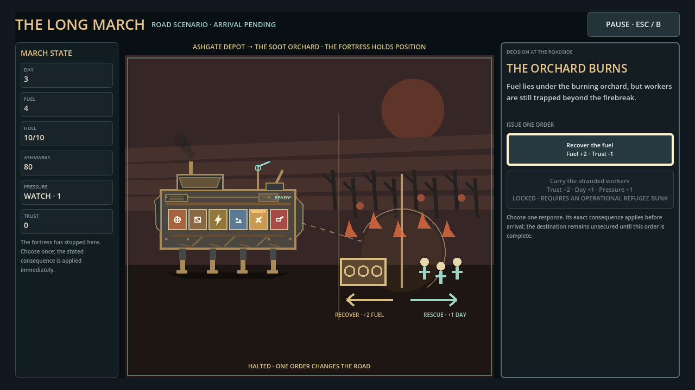

# The Long March

The Long March is a single-player strategy roguelite about keeping a walking fortress alive across a ruined continent.

The fortress is both your vehicle and your settlement. Engines need fuel, weapons need ammunition, workshops need crew and parts, and exposed systems attract different threats. You choose what the machine carries, which road it risks, what it protects in contact, and what it can afford to repair afterward.



_Current code-native alpha presentation. Final art and animation are still in development._

## Play the current private alpha

[Open the releases page](https://github.com/raphaelroshan/the-long-march/releases) and choose the newest prerelease.

- **Windows:** download the standalone `.exe`.
- **macOS:** download the standalone `.zip`, extract it, and open the app.
- **Linux:** download the standalone `.x86_64`, mark it executable, and launch it.
- **Observed playtest:** download the matching `Cohort.zip`; it includes the manifest, source snapshot, observer guide, session template, and local review tools.
- **Integrity:** use the attached `SHA256SUMS.txt` for release assets. Cohort manifests verify every file inside an observer archive.

This is a test build, not a public launch or storefront-ready release. Saves and optional feedback reports stay on the local machine; the game performs no analytics upload.

## The playable loop

```text
settlement bazaar
→ inspect and refit the fortress
→ accept or decline a practical obligation
→ compare uncertain roads and commit exact costs
→ watch the fortress travel
→ resolve roadside events and step-based contacts
→ repair, refuel, or preserve scarce recovery actions
→ reach a regional finale and review the surviving machine
```

Battles resolve through deterministic simulation. The player still chooses the chassis layout, route, doctrine, and one well-timed emergency order. Enemy intent, target selection, predicted damage, impact, and dependency consequences remain visible before the next step.

## Current vertical slice

| Journey | Pressure | Recovery | Finale |
|---|---|---|---|
| **First Watch** | Guided engine, weapon, workshop, road, contact, damage, and repair lessons | Muster recovery siding | Certification into Ashgate |
| **Ashgate Lowlands** | Blockade pressure, uncertain roads, a convoy promise, Iven Pell or Mara Flint | Morrowline Camp | Meridian Pass and the Siege Beast |
| **Flooded Veyru** | Rising water, route closures, a named medicine carrier, Flood Surges | Evacuation Camp | The Dry Archive and Civic Guardian |
| **The Cinder Spine** | Moving fireline, steep grades, a heat-bearing dynamo contract, and the heavy cut-away Ridge Crawler | Old Lift Station | Switchback Commune and the Elevator Warden |
| **White Salt Expanse** | Open sightlines, scarce water, a beacon escort, and an alternate cut-away chassis | The Windbreak | Salt Citadel and a rival fortress |

The four campaign chapters are isolated five-contact test journeys. They share the same fortress simulation, accessibility settings, save system, recovery rules, and terminal debrief, but they do not pretend the broader campaign is complete.

## What makes the fortress matter

- **Physical dependencies:** placement decides whether engines, weapons, workshops, signals, armor, cargo, and refuge systems function.
- **Readable uncertainty:** roads distinguish known facts, forecasts, and unscouted hazards without hiding committed costs.
- **Causal contact:** threats announce their route, target, expected impact, visible counters, and resulting dependency failures.
- **Failure-forward recovery:** most non-final defeats retreat to a valid anchor with explicit time, money, pressure, and damage costs.
- **Operational characters:** specialists change forecasting, repair, crew space, routes, or later obligations instead of acting as detached dialogue bonuses.
- **Campaign memory:** five named developments unlock visible later-run choices; Debrief composes survival, regional direction, and promise state without reducing the run to one score.

## Controls and comfort

Mouse, keyboard, and controller are supported. Pause offers both **Resume Here**, which restores the exact prior control, and **Go to…**, which focuses the current required decision without activating it.

The build includes 100%/110% text size, Standard/High visual contrast, reduced transition motion, remappable A/B controller confirmation, interface-audio volume, local save management, and a readable offline data panel.

## Run from source

Use Godot 4.4.1 with export templates.

```bash
python3 tools/validate_content.py --manifest content/content_manifest.json
bash scripts/verify.sh
```

Run the project to open the title menu. For local desktop exports:

```bash
bash scripts/export_playtest.sh windows
bash scripts/export_playtest.sh macos
bash scripts/export_playtest.sh linux
```

Generated builds go to `build/` and are ignored by Git. Pull requests re-download and verify exact packaged Windows and Linux cohorts. Owner-created `v*` tags run guarded Windows, macOS, and Linux builds through launch smoke, manifest verification, complete local-evidence smoke, archive, checksum, and prerelease publication.

## Run an observed playtest

From an extracted cohort, create a fresh observer sheet outside the retained artifact:

```bash
python tools/prepare_playtest_session.py artifacts/release_manifest.json --session 1 --output ../long-march-session-01.md
```

The command verifies the complete cohort before recording its exact build, platform, commits, toolchain, and digests. It refuses altered cohorts and existing observer files. After a session, `tools/finalize_playtest_session.py` can bind that sheet to the matching local feedback export in a new checksummed packet without modifying either original; `tools/summarize_playtest_packets.py` verifies those packets before cohort review. Generated packets and reports use create-only output. Human notes, consent, direct quotes, and issue severity remain human-owned; automated interaction counts are never treated as proof of comprehension.

## Design and development references

- [Agent handoff roadmap](docs/agent_handoff_roadmap.md) — current implementation baseline and next evidence gate.
- [Journey presentation vertical slice](design/journey_presentation_vertical_slice.md) — settlement, planning, travel, contact, roadside event, and arrival contracts.
- [Fortress visual modes](design/fortress_visual_modes.md) — the shared fortress across rest, travel, contact, recovery, and debrief.
- [Gameplay framework](design/gameplay_framework.md) — dependency, budget, route, threat, and recovery principles.
- [Private-alpha session sheet](docs/private_alpha_session_sheet.md) — uncoached observation protocol and capture matrix.
- [Visual evidence gallery](docs/visual_evidence_gallery.md) — versioned implementation captures and their limits.
- [Latest verification report](docs/latest_test_report_2026-08-31.md) — current automated evidence and explicit non-claims.

## Scope boundary

The repository does not yet contain the full continent campaign, final character or fortress art, final music and combat audio, a complete cargo economy, storefront SDKs, signing/notarization, or commercial packaging. New breadth is intentionally gated on repeated findings from consented, uncoached playtests of the existing journeys.


## Early Access breadth contract

The skeletal-but-playable Early Access target is defined in [`docs/early_access_requirements.md`](docs/early_access_requirements.md). It preserves Ashgate Lowlands and Flooded Veyru as quality anchors while requiring four complete regions, broader fortress/module/threat coverage, distinct settlement and route identities, failure-forward regional developments, multiple viable loadout plans, and release-safe persistence before Early Access claims are made.

- [Early Access requirements](docs/early_access_requirements.md) — skeletal-but-playable campaign breadth floor, quality gates, and agent-executable expansion order.
- [Early Access decision record](docs/early_access_decision.md) — breadth-versus-final-art and complexity-versus-comprehension trade-offs.
- [Early Access candidate](docs/early_access_candidate.md) — implemented scope, verification, save compatibility, rollback, and approval boundary.
- [Known limitations](docs/early_access_known_limitations.md) — temporary content, unsupported features, and human validation still required.
