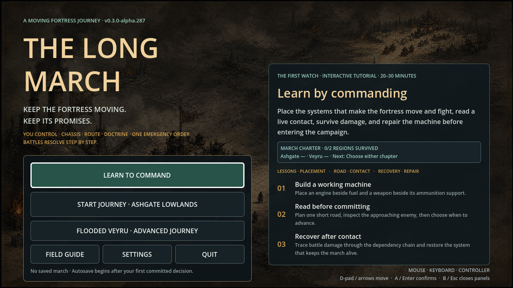
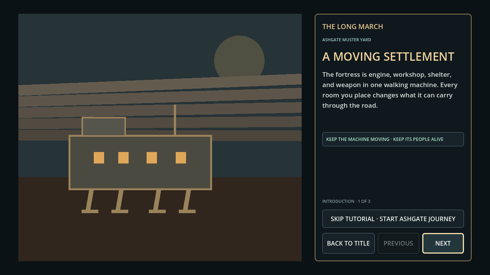
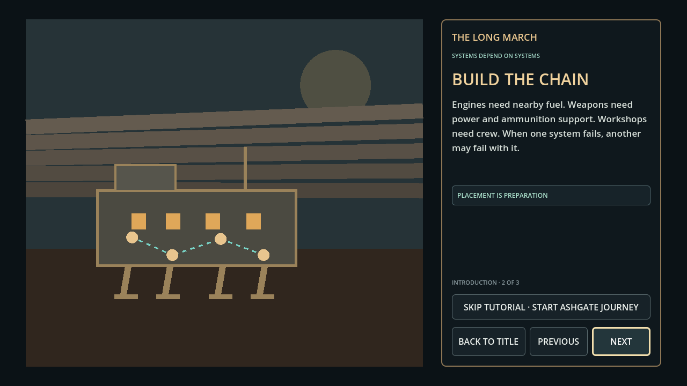

# The Long March — Latest Main Test Report

## Build and verification

| Field | Result |
|---|---|
| Branch tested | `origin/main` |
| Build | `0.3.0-alpha.287` |
| Engine | Godot 4.4.1 |
| Visual test display | 1280×720 Xvfb display |
| Automated verification | PASS: version consistency, content, release manifest, fortress state, campaign, playtest journal, interface audio, visual contrast, silhouette, road contact, events, recovery, controller, settlement, shell, tutorial, complete flow, and Flooded Veyru UI suites |
| Runtime smoke | PASS: project launched and advanced into First Watch introduction |

## Captured evidence

The screenshots were captured from the actual latest main build and are stored under [`docs/visual_evidence/v0.3.0-alpha.287-latest-test-2026-08-30/`](visual_evidence/v0.3.0-alpha.287-latest-test-2026-08-30/).

## Findings

The latest build is the strongest of the three at the tested 1280×720 size. The title has a coherent visual identity, exposes the exact version, and makes First Watch and the two journey chapters easy to distinguish. The First Watch introduction is readable and has a convincing moving-fortress silhouette. The smoke test successfully reaches tutorial content, but it does not yet prove the full contract from tutorial to live refit, route planning, road contact, recovery, and Debrief in one player-facing run.

## Alpha.288 follow-up

The smoke-test gap above is closed by [`l1_complete_journey_handoff_report.md`](l1_complete_journey_handoff_report.md). Alpha.288 adds one clean-save, app-shell integration run through First Watch and the full five-contact Ashgate journey, including save/resume checks at committed departure and completed arrival. Its 1600×900 evidence sequence is the baseline for the next responsive-layout pass.

## Next roadmap steps

### March Quality 1 — Full journey capture and handoff validation

Run a complete First Watch-to-Ashgate journey using a clean save. Verify that tutorial completion hands off to the live contract without losing context, that the fortress persists across settlement and travel modes, and that the player can reach contact, recovery, and Debrief without hidden debug actions. Store a complete 1600×900 evidence sequence.

### March Quality 2 — Road-contact cause-and-effect pass

Validate that every major contact communicates forecast, approach, target lock, wind-up, impact, dependency damage, and the next available response. Use reduced-motion and controller paths as separate checks. The report must make a player’s failure or survival understandable without requiring the March Record.

### March Quality 3 — Settlement and route identity

Give Ashgate, Morrowline, Lantern Quay, and Evacuation Camp distinct visual and service identities. Each settlement should change a meaningful preparation decision without becoming a menu-only reskin. Confirm that route choices communicate obligation, pressure, recovery point, and closure risk before commitment.

### March Quality 4 — Human validation before content breadth

Run the existing five-session private-alpha protocol. Measure whether new players understand module dependencies, route risk, emergency orders, recovery, and the meaning of a non-final defeat. Only after repeated comprehension should the project add more modules, regions, or story branches.

## Evidence interpretation

This report records an internal alpha test. The screenshots are suitable for a development archive and Kickstarter field-journal concept, but they are not final store art or evidence of release readiness.
