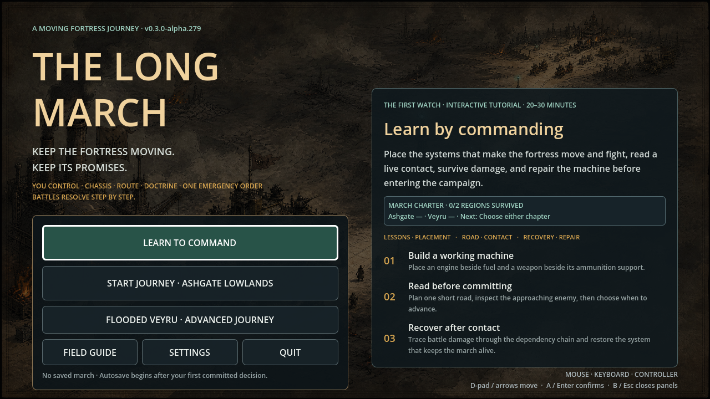

# The Long March — Visual Evidence Gallery

This gallery preserves the available PR41 journey-shell screenshots for `v0.3.0-alpha.279`. They document the First Watch onboarding and the moving-fortress premise at the point where the project moved from isolated prototype screens toward a continuous journey. They are internal development evidence, not final marketing art.

## Capture record

| Field | Value |
|---|---|
| Build | `v0.3.0-alpha.279` |
| Source | PR #41 release-candidate source artifact, locally recaptured after resource import |
| Engine | Godot 4.4.1 |
| Capture presentation | 1280×720 virtual display |
| Capture scope | Title, First Watch introduction, dependency lesson |
| CI artifact note | PR #41’s CI artifact contained the executable and source archive but no screenshot files; these images are local recaptures from that exact source revision |

## Screenshots

### Title and First Watch entry

The title establishes the moving-fortress premise and presents First Watch, Ashgate Lowlands, Flooded Veyru, Field Guide, and Settings as connected entry points.

### First Watch introduction

The first lesson introduces the fortress as a moving settlement rather than a conventional inventory or detached battle screen.

### First Watch dependency lesson

The second lesson makes the dependency chain visible: engines need fuel, weapons need power and ammunition support, and workshops need crew. This is the core comprehension target for the first journey.

## Kickstarter bonus-content framing

A Kickstarter campaign could present this set as **“The Long March Field Journal: First Watch”**. The value is the visible design progression from title premise to onboarding, physical fortress logic, and the first readable dependency lesson.

A strong digital bonus would combine the screenshots with a short annotated journey diary, a fortress dependency diagram, a route-planning excerpt, and a behind-the-scenes explanation of how deterministic simulation is separated from presentation. The material should be framed as a development archive or founder’s field journal, not as a promise that every shown interface element is final.

Because this capture set is a local recapture from PR #41 rather than a preserved CI screenshot artifact, any campaign page should label it accurately as **“captured from the PR41 alpha build”**. Keep the exact build number visible in the archive and avoid implying final art, final audio, a completed campaign, or a guaranteed release date.
