# The Long March — Visual Evidence Gallery

This gallery preserves versioned presentation captures from the playable alpha. They are internal development evidence, not final marketing art and not evidence that an uncoached player understood the interface.

## Alpha.347 — compact header and command clearance

[Standard 1600×900](visual_evidence/v0.3.0-alpha.347-header-command-clearance-1600x900/) and [compact 1280×720](visual_evidence/v0.3.0-alpha.347-header-command-clearance-1280x720/) captures show the transient save receipt occupying unused header space rather than covering the route breadcrumb. The compact contact frame also keeps all four emergency orders visible together. These images verify layout geometry, not player comprehension.

## `v0.3.0-alpha.338` — Soot Orchard decision before arrival

| State | Evidence | SHA-256 |
|---|---|---|
| Contact cleared; destination unsecured | [Orchard road scenario](visual_evidence/v0.3.0-alpha.338-orchard-road-event/01_orchard_before_arrival.png) | `dcbe28e286d3399e2a8fadc733e4c05d2a00cace125962213ba97ff6e4534d39` |
| Decision applied; arrival complete | [Orchard arrival receipt](visual_evidence/v0.3.0-alpha.338-orchard-road-event/02_orchard_arrival.png) | `fa66e2798eef2f988b72f393e90e68862525e978d6273a5bc667cfe4c8c1122c` |

The first frame keeps the fortress at Ashgate Depot with The Soot Orchard still pending. The second appears only after the fuel decision, moves the fortress to the Orchard, records the secured route, and repeats the choice consequence in the arrival report.

## `v0.3.0-alpha.337` — Soot Orchard decision tableau

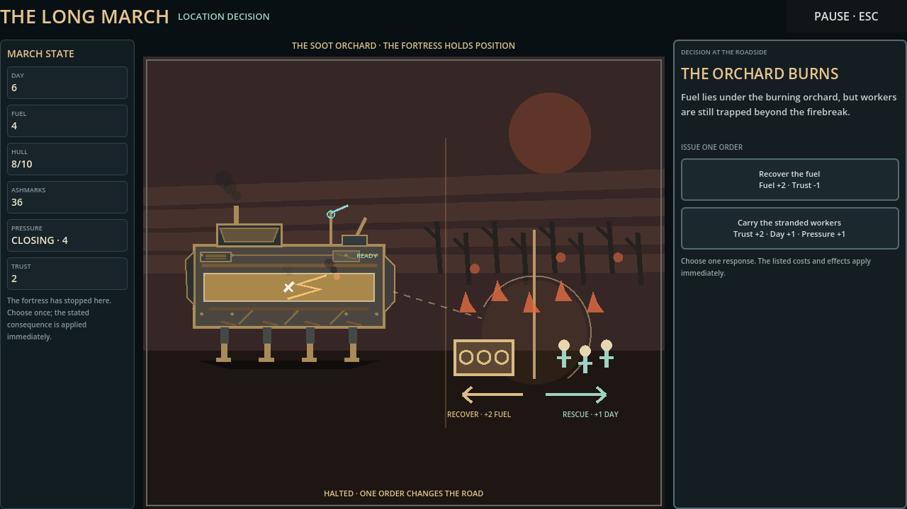

The event scene now identifies the burning orchard through blackened rows, fire pockets, a central firebreak, a recoverable fuel cache, and three stranded workers. Separate visual directions reinforce the exact fuel-versus-time-and-trust choice without replacing the authoritative buttons.

SHA-256: `82bee4b68e05318f826adbde4b165c7ee20d7734a874760f2cbacdeb0f1c2aed`

## `v0.3.0-alpha.336` — Pre-contact road interruption

| Profile | Evidence | SHA-256 |
|---|---|---|
| 1600×900 | [The Lift Chain Sings between march and contact](visual_evidence/v0.3.0-alpha.336-pre-contact-road-interruption-1600x900/01_lift_chain_interruption.png) | `cca49ba7838394381afabac335adc4da4a2e78729412dfbb77e4e73a11d92eac` |
| 1280×720, 110% text, high contrast, reduced motion | [Responsive interruption handoff](visual_evidence/v0.3.0-alpha.336-pre-contact-road-interruption-1280x720/01_lift_chain_interruption.png) | `35d628540660d0688fe16f9fc6916812e8f070e8aaa841d7c394c973c20f3baa` |

The fortress remains at Ashgate while the selected Rill Crossing contact waits at step zero. The tableau names both ends of the road, exposes both exact consequences, and states that the committed contact cannot be bypassed. These captures verify implemented layout and state continuity, not uncoached comprehension or final art quality.

## `v0.3.0-alpha.334` — Station receipt focus

| Receipt | Evidence | SHA-256 |
|---|---|---|
| Quartermaster | [Completed trade with Store Review focused](visual_evidence/v0.3.0-alpha.334-station-receipt-focus/02a_quartermaster_trade.png) | `a06d72fc5a8964c703aeadfc2f684609523d3e679a938975eb6441676fa78273` |
| Signal Broker | [Acquired report with broker landmark focused](visual_evidence/v0.3.0-alpha.334-station-receipt-focus/02b_signal_report.png) | `cfa4ae99207b653038645424b5a997dcef4b2b35a2bc336cd90fc82c1da296aa` |

Both screenshots capture the immediate post-checkpoint state. Focus remains local to the completed transaction instead of jumping to the still-required assignment.

## `v0.3.0-alpha.333` — Hiring Post lead

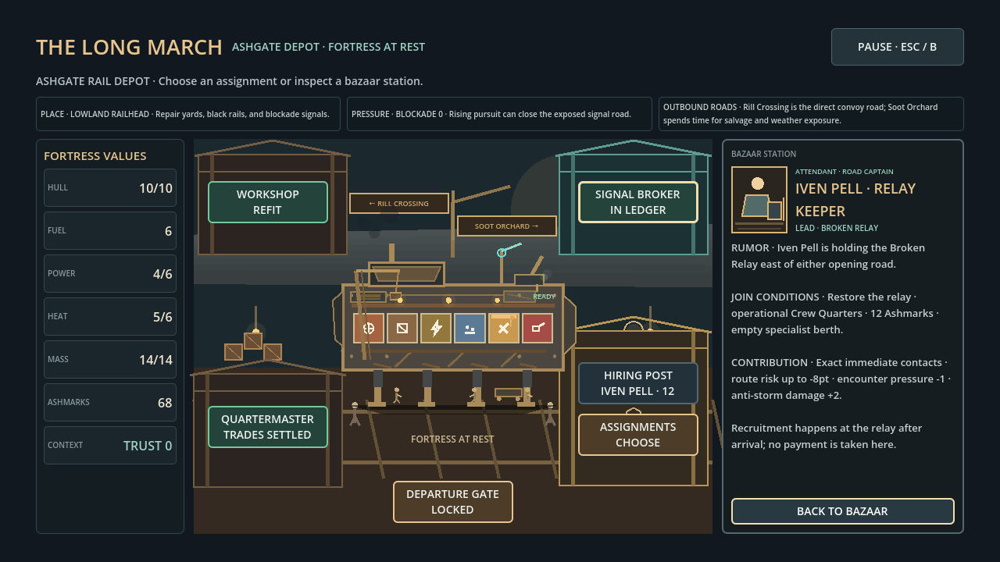

The Ashgate Hiring Post gives Iven Pell a location, role, complete join conditions, exact implemented contribution, and a clear no-payment-here boundary before the player chooses a road. It points toward the existing Broken Relay encounter rather than adding remote recruitment.

SHA-256: `b92dcc5ee1b9d9fc7fbf407754705a1fa401e88334dc375f23e8e7b30d1f2001`

## `v0.3.0-alpha.332` — Bounded Quartermaster market

| State | Evidence | SHA-256 |
|---|---|---|
| Trade preview | [Exact buy and stored-only sale terms](visual_evidence/v0.3.0-alpha.332-quartermaster-market/02a_quartermaster_offer.png) | `35367311533f3473c31a2fd3e823df13baffc3c2012244a34ddda32120e80513` |
| Trades complete | [Armor stored and cannon sold](visual_evidence/v0.3.0-alpha.332-quartermaster-market/02a_quartermaster_trade.png) | `9cc8d3b86508109e82e5513f144a9b75ca81352632307db886970b0bd2a4e0b7` |

The first capture keeps both exact transactions and their module consequences visible at 1280×720. The second confirms that the armor remains stored for later Workshop installation and the cannon sale cannot remove any installed fortress system.

## `v0.3.0-alpha.331` — Authored route intel

| State | Evidence | SHA-256 |
|---|---|---|
| Purchased report | [Signal Broker ledger receipt](visual_evidence/v0.3.0-alpha.331-authored-route-intel/02b_signal_report.png) | `2fa39de1d91501ef56363408aa584db3a8bc0867f0b5be88ae6c60f212264c07` |
| Selected informed road | [Sourced Soot Orchard dossier](visual_evidence/v0.3.0-alpha.331-authored-route-intel/03b_route_selected.png) | `a3357c1c76c6d19758556179cbba8fa9af5ea7ee497160d3528ea50b89a65236` |

The broker states the exact price and records the source and confidence. The route dossier reveals the authored Storm Front contact and counter guidance while retaining the same fuel, time, pressure, risk, and encounter-difficulty calculations as the unpurchased forecast.

## `v0.3.0-alpha.303` — Threat silhouettes

[Seven threat-family captures](visual_evidence/v0.3.0-alpha.303-threat-silhouettes/) show distinct physical actors and approach lanes for Road Raiders, Climbers, Burrowers, Storm Fronts, the Siege Beast, Flood Surges, and the Civic Guardian. Text remains authoritative for intent, target, counter, damage, and dependency consequence.

These code-native actors are readability prototypes rather than final creature or vehicle art.

## `v0.3.0-alpha.302` — Destination arrival identity

[Ashgate and Veyru arrival captures](visual_evidence/v0.3.0-alpha.302-arrival-identity/) show the training siding, broken crossing, Meridian threshold, flood machinery, evacuation platform, and Dry Archive. Every composition is selected from the authoritative destination ID and keeps the same fortress and applied consequence receipt visible.

These are code-native alpha silhouettes intended to test place recognition, not final location art.

## `v0.3.0-alpha.301` — Temporary travel atmosphere

[Departure, full-march, and contact-approach captures](visual_evidence/v0.3.0-alpha.301-temporary-travel-atmosphere/) show the new beat-specific pace, temporary tinted road atmosphere, and static contact brace. The route receipt and named contact remain authoritative; the effects do not drive simulation.

The dust/mist frames are CC0 testing placeholders. Tiny Town remains intentionally unused.

## `v0.3.0-alpha.300` — Temporary sensory feedback

[Impact, consequence, and recovery captures](visual_evidence/v0.3.0-alpha.300-temporary-sensory-feedback/) show the restrained temporary spark and damage-smoke treatment. Audio routing is documented separately in [`audio_cue_map.md`](audio_cue_map.md), because screenshots cannot establish sound quality.

The integrated files are CC0 testing placeholders. Tiny Town remains intentionally unused because it conflicts with the current visual direction.

## `v0.3.0-alpha.299` — Battle and recovery causality

This set records the strategy follow-up that connects a road contact's wind-up, target, impact, dependency consequence, arrival receipt, and recovery priority.

| Profile | Evidence | Contract |
|---|---|---|
| 1600×900 | [Combat beats and complete recovery handoff](visual_evidence/v0.3.0-alpha.299-battle-recovery-causality-1600x900/) | Named target, exact impact, dependency cascade, First Watch/live arrival, recovery, and Debrief |
| 1280×720 | [Responsive arrival and recovery handoff](visual_evidence/v0.3.0-alpha.299-battle-recovery-causality-1280x720/) | 110% text, high contrast, reduced motion, alternate controller guidance, and visible required actions |

The contact effect visualizes an already-resolved outcome. Text remains authoritative for target, damage, dependency state, and repair priority.

## `v0.3.0-alpha.298` — Presentation clarity

This targeted set records the visual-quality pass prompted by the alpha.297 review: stronger fortress state, three distinct travel beats, explicit threat-to-target intent, a more inhabited bazaar, isolated roadside decisions, and a causal Debrief summary.

| Profile | Evidence | Contract |
|---|---|---|
| 1600×900 | [Presentation sequence and threat-response frames](visual_evidence/v0.3.0-alpha.298-presentation-clarity-1600x900/) | Standard text and motion, including the corrected title capture, moving landmark, contact horizon, target path, event, and Debrief |
| 1280×720 | [Responsive presentation sequence](visual_evidence/v0.3.0-alpha.298-presentation-clarity-1280x720/) | 110% text, high contrast, reduced motion, alternate controller guidance, and preserved three-column bounds |

The visuals remain code-native alpha art. These captures demonstrate the implemented presentation contract, not final asset quality or human comprehension.

## `v0.3.0-alpha.297` — Complete journey acceptance

The current private-alpha baseline has a complete capture from title and First Watch through Ashgate preparation, route commitment, travel, contact, arrival, roadside consequence, Morrowline recovery, Meridian Pass, and Debrief.

| Profile | Evidence | Contract |
|---|---|---|
| 1600×900 | [Complete journey sequence](visual_evidence/v0.3.0-alpha.297-complete-review-1600x900/) | Standard text and presentation motion, including separate road-in-motion and contact-ahead beats |
| 1280×720 | [Complete responsive sequence](visual_evidence/v0.3.0-alpha.297-complete-review-1280x720/) | 110% text, high contrast, reduced motion, and alternate controller guidance |

These runs use the same visible controls as a player and require no debug action. They prove deterministic completion, focus reachability, and supported-layout bounds; they do not claim uncoached comprehension or enjoyment.

## `v0.3.0-alpha.279` — First Watch journey shell

These PR41 captures document the First Watch onboarding and the moving-fortress premise at the point where the project moved from isolated prototype screens toward a continuous journey.

### Capture record

| Field | Value |
|---|---|
| Build | `v0.3.0-alpha.279` |
| Source | PR #41 release-candidate source artifact, locally recaptured after resource import |
| Engine | Godot 4.4.1 |
| Capture presentation | 1280×720 virtual display |
| Capture scope | Title, First Watch introduction, dependency lesson |
| CI artifact note | PR #41’s CI artifact contained the executable and source archive but no screenshot files; these images are local recaptures from that exact source revision |

### Screenshots

#### Title and First Watch entry

The title establishes the moving-fortress premise and presents First Watch, Ashgate Lowlands, Flooded Veyru, Field Guide, and Settings as connected entry points.

#### First Watch introduction

The first lesson introduces the fortress as a moving settlement rather than a conventional inventory or detached battle screen.

#### First Watch dependency lesson

The second lesson makes the dependency chain visible: engines need fuel, weapons need power and ammunition support, and workshops need crew. This is the core comprehension target for the first journey.

## `v0.3.0-alpha.285` — Starting-settlement identity

These captures document the same fortress-at-rest composition in the two starting settlements after the regional-identity pass. The layout and interaction contract are intentionally stable; the surrounding work, material palette, weather, and local obligation change.

### Capture record

| Field | Value |
|---|---|
| Build | `v0.3.0-alpha.285` |
| Source | Branch head `7e0946c4e5b8eb698bb63f5a7ad6102606d66bf2`, merged by PR #48 |
| Engine | Godot 4.4.1 |
| Capture presentation | 1280×720 virtual display, 100% text, Standard contrast |
| Capture scope | Ashgate Depot and Lantern Quay opening assignment state |
| Evidence class | Deterministic presentation inspection; no human comprehension claim |

### Ashgate Depot rail bazaar

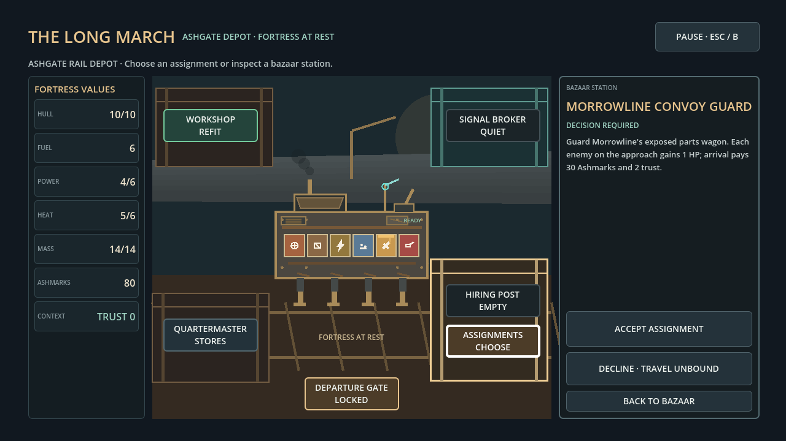

Black rails, sleepers, an industrial gantry, dust, and warm metal frame the opening Morrowline obligation. The workshop, quartermaster, signal broker, assignment board, hiring post, and departure gate retain their shared positions.

SHA-256: `944b6ff04d01a733a4e29a9e55a7a6b775bacdae96e269612fd8976da4521069`

### Lantern Quay flood market

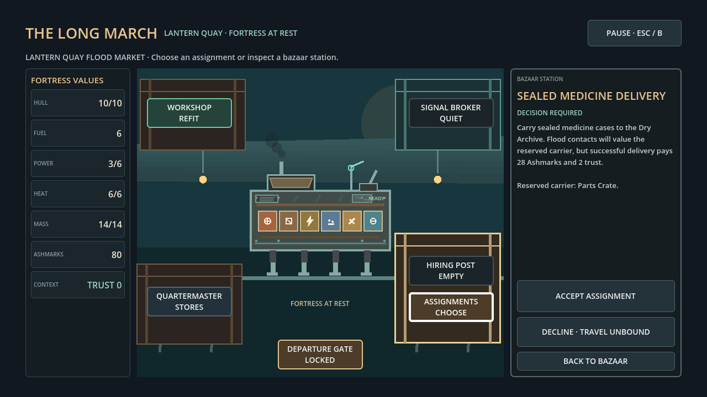

A raised dock, pilings, hanging lamps, cool wet surfaces, and the visible waterline frame the sealed-medicine obligation. The stable station layout makes the environmental and contractual difference readable without teaching a second navigation scheme.

SHA-256: `774ef548a62688f786f32e2e340372acd203ac71cbc419b947086ef6570bae20`

## `v0.3.0-alpha.292` — Four-stop route identity

These 1280×720 captures add operational context to the established settlement motifs. Each stop names its current pressure, local stake, service priority, and outbound road trade-offs while keeping the fortress and required actions visible.

| Settlement | Evidence | SHA-256 |
|---|---|---|
| Ashgate Depot | [Railhead and opening-road brief](visual_evidence/v0.3.0-alpha.292-l5-settlement-route-identity/01_ashgate_depot.png) | `fcddeec946461708600f4fbedc6a83ec5d52c5a75f24b53c1d0e84705b99a8cb` |
| Lantern Quay | [Floodline market and opening-road brief](visual_evidence/v0.3.0-alpha.292-l5-settlement-route-identity/02_lantern_quay.png) | `65fc5a2fff324195f2167acd25b10071d263216a18947ddf29f275d20199247b` |
| Morrowline Camp | [Convoy stake and three-road recovery choice](visual_evidence/v0.3.0-alpha.292-l5-settlement-route-identity/03_morrowline_camp.png) | `0886327d39f95a0f17ae0b73fc0521e8387255c66afbdae34cf87af7b98e3739` |
| Evacuation Camp | [Medicine stake and archive-road recovery choice](visual_evidence/v0.3.0-alpha.292-l5-settlement-route-identity/04_evacuation_camp.png) | `f24613a8421a1a0733e3feeb14577b892c144e4ba73440e61e60510b46d55fe1` |

## Kickstarter bonus-content framing

A Kickstarter campaign could present this set as **“The Long March Field Journal: First Watch”**. The value is the visible design progression from title premise to onboarding, physical fortress logic, and the first readable dependency lesson.

A strong digital bonus would combine the screenshots with a short annotated journey diary, a fortress dependency diagram, a route-planning excerpt, and a behind-the-scenes explanation of how deterministic simulation is separated from presentation. The material should be framed as a development archive or founder’s field journal, not as a promise that every shown interface element is final.

Because this capture set is a local recapture from PR #41 rather than a preserved CI screenshot artifact, any campaign page should label it accurately as **“captured from the PR41 alpha build”**. Keep the exact build number visible in the archive and avoid implying final art, final audio, a completed campaign, or a guaranteed release date.

## `v0.3.0-alpha.304` — Inhabited fortress at rest

These 1280×720 captures verify that the shared resting fortress now carries visible crew scale and service activity in both starting settlements without changing bazaar actions or authoritative state.

| Settlement | Evidence | SHA-256 |
|---|---|---|
| Ashgate Depot | [Rail-yard service activity](visual_evidence/v0.3.0-alpha.304-inhabited-rest/01_ashgate_depot.png) | `149a97b4c438a9b993d15b2a90f6aa42b4e9ad8dd134442d576f19a1cdf7aabb` |
| Lantern Quay | [Flood-dock service activity](visual_evidence/v0.3.0-alpha.304-inhabited-rest/02_lantern_quay.png) | `c54985d95ff6e70f292cda0f2a6d9e7f868d257a61771315d88d6187f972bef7` |

The crane, hoist, parts cart, crew silhouettes, valve exhaust, and lamp cycle are presentation-only. Reduced Motion retains the tableau but freezes ambient movement. These images establish implementation coverage, not human-recognition evidence or final-art quality.

## `v0.3.0-alpha.305` — Route-map visual grammar

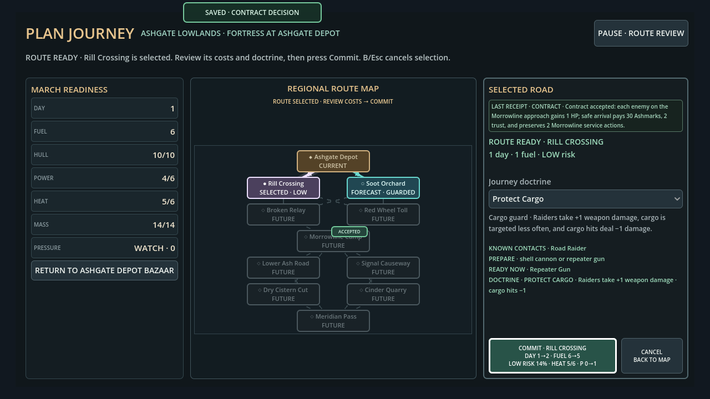

The 1280×720 route-planning capture shows the fortress position, selectable alternatives, selected road, future branches, and accepted Morrowline obligation through both color and shape. Future edges are dashed, active edges are directional, and the accepted assignment badge stays attached to its destination.

SHA-256: `8c26af59f5ccf5b3746997e08573b3dcb81bd50d850293d42fcc1a65331e2cbb`

## `v0.3.0-alpha.306` — Roadside occurrence identity

| Occurrence | Evidence | SHA-256 |
|---|---|---|
| The Boiler's Second Heartbeat | [Damaged bearing and cadence choice](visual_evidence/v0.3.0-alpha.306-roadside-occurrence-identity/01_boiler_heartbeat.png) | `d35ad129689318a956b6ea9ab3f5da80ee9abd9c49270bf7ff339412f3559fb4` |
| The Lift Chain Sings | [Loaded lift and brace choice](visual_evidence/v0.3.0-alpha.306-roadside-occurrence-identity/02_lift_chain.png) | `a0b78e6f10a36e54406ccb7890a3f7aaade7373b81cdf942dfb3282b520e5baf` |
| The Miller With a Broken Wheel | [Stopped wagon and workshop-time choice](visual_evidence/v0.3.0-alpha.306-roadside-occurrence-identity/03_miller_wheel.png) | `c9e5ed609397b70e2acd43dd4d21b9fb3f70c73c4061f6b95124158f10c6ed74` |

All three use the existing one-order roadside interaction and exact authoritative effects. The images verify visual specificity and layout, not human comprehension or final-art quality.

## `v0.3.0-alpha.307` — Tutorial fortress continuity

| Prologue page | Evidence | SHA-256 |
|---|---|---|
| A Moving Settlement | [Shared fortress at rest](visual_evidence/v0.3.0-alpha.307-tutorial-fortress-continuity/01_moving_settlement.png) | `e63932e190aaf9c29c2808fca0474e57c663c3733dc9da645b0ca2baa8c8d88d` |
| Build the Chain | [Module-family dependency overlay](visual_evidence/v0.3.0-alpha.307-tutorial-fortress-continuity/02_dependency_chains.png) | `31da001dba0db38d3fa3ad58d721894d90694391c093aa40f1ff98aeb9c5c147` |
| Read the Road | [Shared fortress departure stance](visual_evidence/v0.3.0-alpha.307-tutorial-fortress-continuity/03_road_ahead.png) | `18c4ce15869597127808991d8698dc344dbe94f3ea4755a47c2d4adbbb11b84b` |

The prologue now teaches with the same visual object used throughout the playable slice. These images verify continuity and layout, not final illustration quality or uncoached comprehension.

## `v0.3.0-alpha.309` — Bazaar attendant identity

| Station state | Evidence | SHA-256 |
|---|---|---|
| Ashgate assignment | [Convoy runner](visual_evidence/v0.3.0-alpha.309-bazaar-attendants/01_ashgate_depot.png) | `c898e1c0dc7b2c912333d0fa49a2a9ce6fce64b81d384377b06d2087388125c0` |
| Ashgate workshop | [Rail-side engineer](visual_evidence/v0.3.0-alpha.309-bazaar-attendants/02_ashgate_workshop.png) | `7d33a64ea18f49c2e522bbfae95257f66ebc74f95eb5629095c3e61b7b50bf5d` |
| Lantern Quay assignment | [Medicine courier](visual_evidence/v0.3.0-alpha.309-bazaar-attendants/02_lantern_quay.png) | `19f4c3d71e10466a1dcd226a6508a1b12ffd987ab81af076c208f72ddc6a6b2e` |
| Lantern Quay signals | [Lantern reader](visual_evidence/v0.3.0-alpha.309-bazaar-attendants/02b_lantern_signal.png) | `cf2df3e38f2962c76de2602e56fc37b205d861940cd5a91202a27a424684b0c9` |

The compact portraits make the selected service feel staffed while retaining the exact action, status, and consequence text. They verify visual differentiation and responsive fit, not final character art or human recall.

## `v0.3.0-alpha.310` — Route-specific travel landmarks

| Committed road | Evidence | SHA-256 |
|---|---|---|
| Rill Crossing | [Bridge ribs passing](visual_evidence/v0.3.0-alpha.310-route-landmarks/03_rill_crossing_travel.png) | `baabdb272f2fd354c7b03114c4840031a2a1b00b7e2c52d3e509c1aff904622d` |
| Pump Gallery | [Gallery wheel passing](visual_evidence/v0.3.0-alpha.310-route-landmarks/03_pump_gallery_travel.png) | `ff53f02dcb99150d4579c4507ae6ef2cd7a5062c99704b8f0e0aa201efddc88f` |

The short travel beat now uses the destination ID already present in the route receipt to select a stable landmark. These images verify authored route identity without claiming that the code-native scenery is final production art.

## `v0.3.0-alpha.313` — Named specialist identity

| Specialist state | Evidence | SHA-256 |
|---|---|---|
| Iven offer locked | [Broken Relay signal-officer card](visual_evidence/v0.3.0-alpha.313-specialist-identity/01_iven_offer_locked.png) | `46f66906694fae9af6b682577efd2cd7d30b872c9423a21ca5a3bc34e789290b` |
| Iven ready to join | [Focused recruitment action](visual_evidence/v0.3.0-alpha.313-specialist-identity/02_iven_offer_ready.png) | `c938df6f643dc836c67369cf71ec02cf2fee2d82675b65322902e66eecf2ac14` |
| Mara at the open forge | [Morrowline recruitment decision](visual_evidence/v0.3.0-alpha.313-specialist-identity/04_mara_meeting.png) | `702d6a0f0ab5109302da54ce07ad9e9780e6143f148b193d7f467f081f395745` |

Iven's card is part of the live route planner and remains legible in both locked and ready states. Mara's silhouette, apron, hammer, and forge persist across her authored chain. The captures verify identity, placement, and focus—not final character illustration or human recall.

## `v0.3.0-alpha.314` — Specialist continuity

| Assigned specialist | Evidence | SHA-256 |
|---|---|---|
| Iven Pell | [Signal officer retained after recruitment](visual_evidence/v0.3.0-alpha.314-specialist-continuity/03_iven_assigned.png) | `c7e5b9c53d7e0806840254e7f1078d02392e88a0de7f4e3dfc4f4452556b2eab` |
| Mara Flint | [Forge master retained at route planning](visual_evidence/v0.3.0-alpha.314-specialist-continuity/04_mara_assigned.png) | `056db9840e59dc0023e1acef1860d8f3860d7b424629bfee0d672030e0b3ff6d` |

The same compact card now persists after recruitment, changes to `ASSIGNED TO FORTRESS`, and names the active route or repair contribution. Iven's screenshot also preserves the recruitment receipt; neither state adds a second action or hidden character system.

## `v0.3.0-alpha.316` — Route browse-state clarity

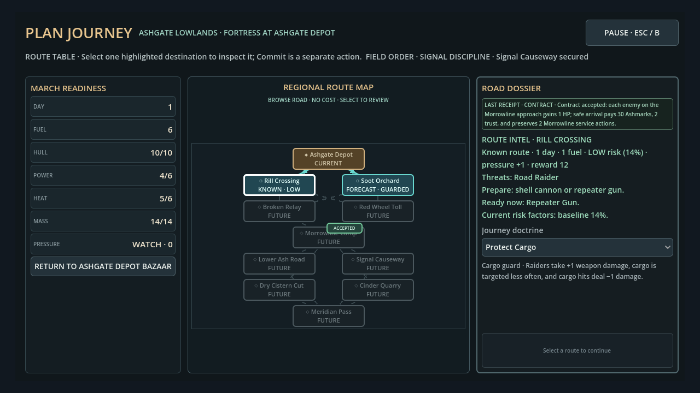

The planner's focused Rill Crossing dossier is explicitly labeled as cost-free browsing. The node remains `KNOWN`, the action remains disabled until selection, and the dock does not claim that a road has already been selected.

SHA-256: `ce6c654848e5d3680733c977071a93190c99f9627333c34bbbe87f703db18d5e`

## `v0.3.0-alpha.317` — Selected-road cost receipt

| Planner state | Evidence | SHA-256 |
|---|---|---|
| Cost-free browse | [No road selected](visual_evidence/v0.3.0-alpha.317-route-cost-receipt/03_route_browse.png) | `a38ed2b2dbfe6c843f7f7bddce9966e266ed55a24eb3609f7628313d2fe9de91` |
| Selected road | [Exact pre-commit receipt](visual_evidence/v0.3.0-alpha.317-route-cost-receipt/03b_route_selected.png) | `f798214f2fa5bdb13804feee3ae2e27867cc33fd6796b06cbbad299d27a6773b` |

The selected-road capture shows destination, day, fuel, pressure, risk, and heat together in the map center before Commit. The high-contrast 1280×720 state verifies that the receipt, dossier, and primary action remain visible; it does not substitute for human route-comprehension evidence.

## `v0.3.0-alpha.318` — Live counter readiness

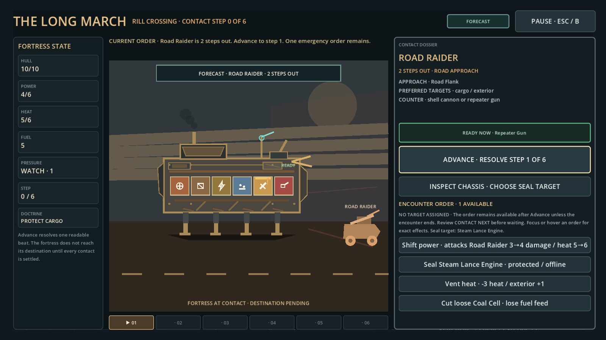

The contact dossier preserves the general Road Raider counter and separately names the fortress's operational Repeater Gun. This verifies that the current answer is visible before the first contact step; it does not claim that a first-time player will choose the right response.

SHA-256: `dc4cf2bf5c3180f16a71c6c293d4ed825ac6aaeece9a2c18466afb6108d3a224`

## `v0.3.0-alpha.319` — Threat risk preview

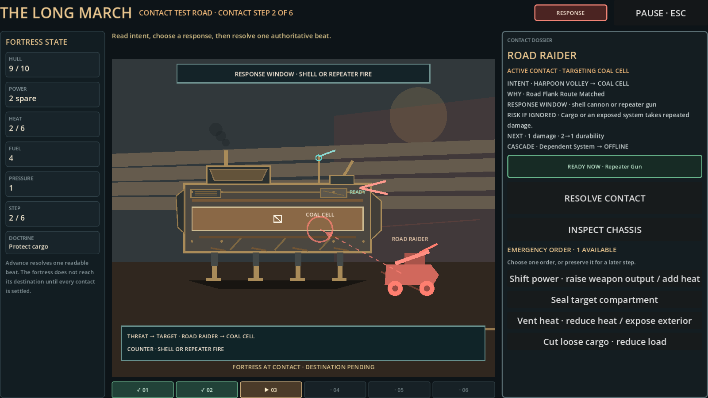

The response-state capture keeps the Road Raider's target, authored counter, practical risk, current Repeater Gun readiness, and available emergency orders in one view.

SHA-256: `c90e4f8d7394a6c47306523af4db450d86bb3c2f97b5f8b1fcc07e961320599d`

## `v0.3.0-alpha.320` — Contact response posture

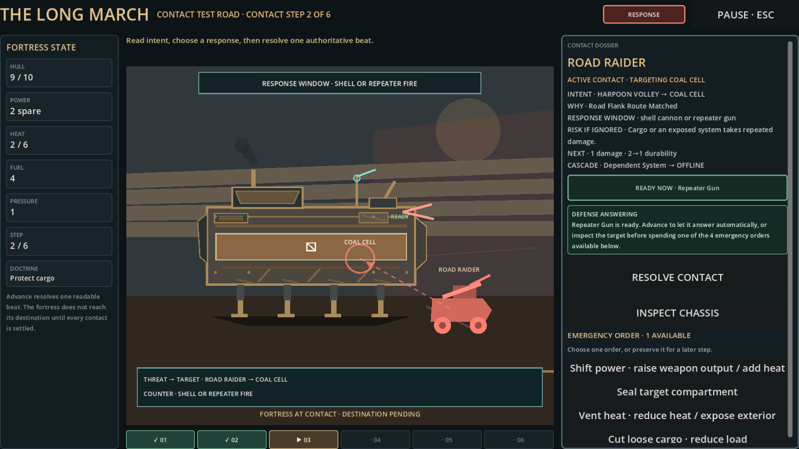

The live dossier now states what the readiness result means for the next input: prepared defenses answer on Advance, while offline or missing counters direct the player toward target inspection and the enabled emergency orders. The prompt remains advisory and does not choose an order or change combat resolution.

SHA-256: `d9b87b3157e9440a239582cb80a5c0adcbdf4c16e835fa63a5a98375d37c5fc4`

## `v0.3.0-alpha.321` — Exact defense effect

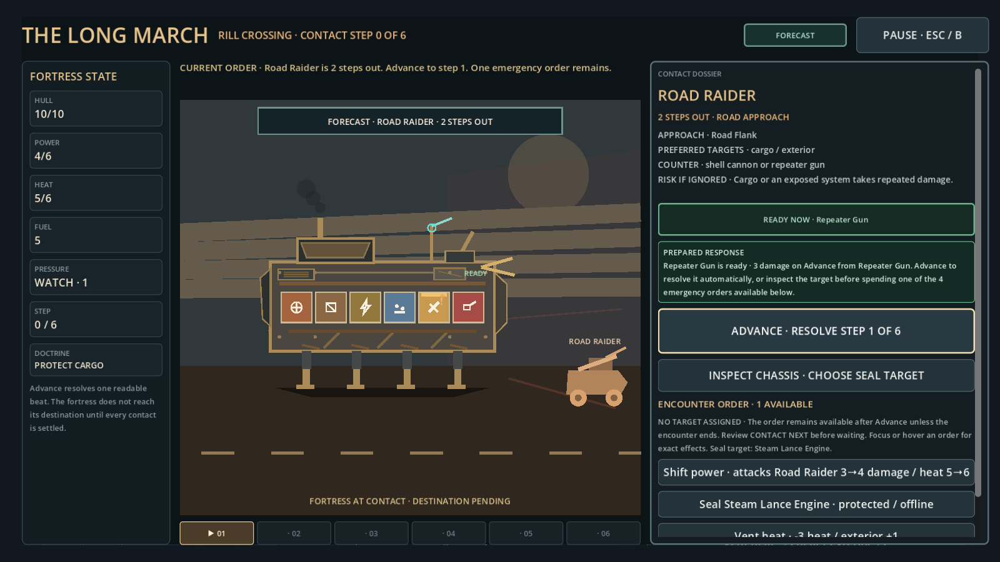

The integrated journey capture shows the live Repeater Gun translated into its exact next-beat output: three damage on Advance. The calculation comes from the authoritative encounter model; the presenter only names the result and source.

SHA-256: `61cc37c96c3f5a36935886b652be190ba31b36df594097908ee4f198a100c65a`

## `v0.3.0-alpha.322` — Target-effective counter label

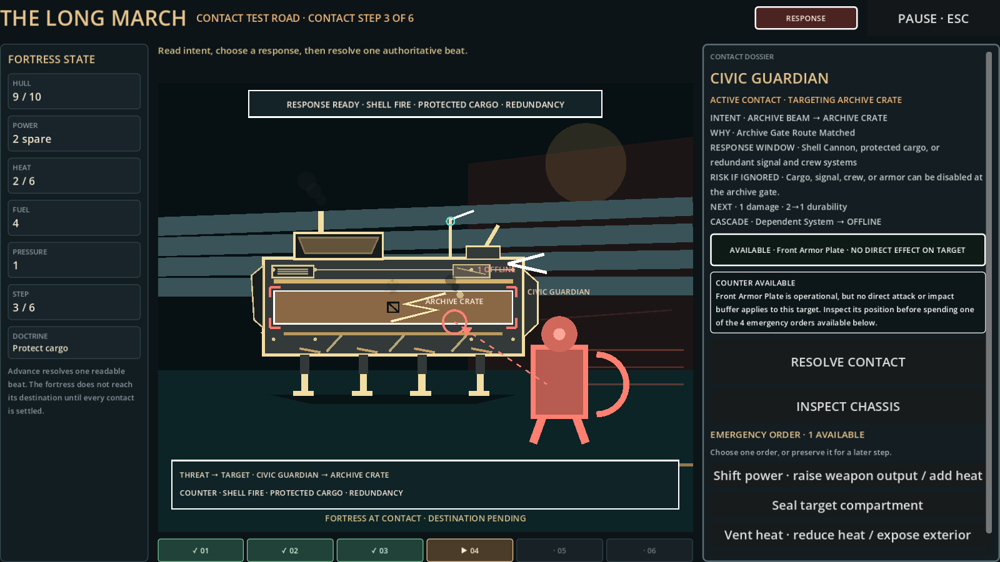

The Civic Guardian is targeting the Archive Crate while the operational Front Armor Plate is not adjacent and contributes no attack. Both readiness receipts therefore say `AVAILABLE` and explain that the current target receives no direct effect, preventing a false promise of protection.

SHA-256: `958613f1bd13cc0d5e5bce97c8a417660553ef08406d59dd5810c382a2ca1f42`

## `v0.3.0-alpha.323` — Compact contact command grid

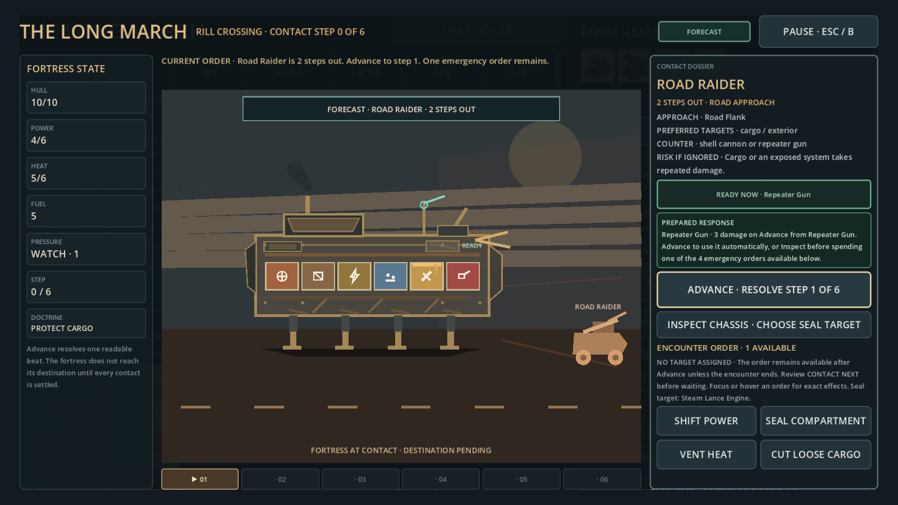

The richer threat dossier no longer pushes emergency orders out of the initial viewport. Concise two-column controls keep all four choices visible at 1600×900; their exact benefits and costs remain in the existing focus/hover help above the grid.

SHA-256: `ea2440e3bf4158588ddd322543447c72a61401687f37a494f7801fa8c32e7694`

## `v0.3.0-alpha.324` — Target-review focus

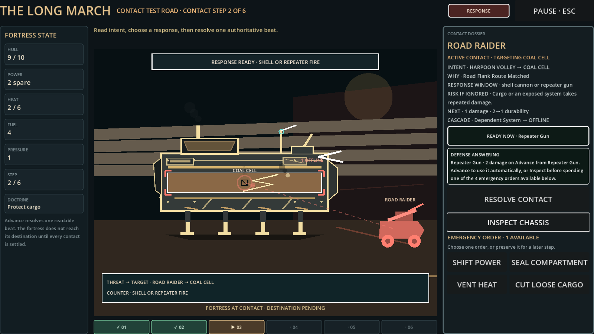

When the Road Raider first assigns the Coal Cell as its target, focus moves from Resolve Contact to Inspect Chassis. The player can still advance immediately, but a repeated confirm no longer resolves another beat before the new target is reviewed.

SHA-256: `e5ddd16b0b7d9b030cf11803d3fd5cd8533698fe904cbd883d10da5a6fec543c`

## `v0.3.0-alpha.361` — Cross-region obligation memory

| Prior Ashgate outcome | Later Veyru evidence | SHA-256 |
|---|---|---|
| Completed | [Morrowline service disclosed before commitment](visual_evidence/v0.3.0-alpha.361-memory-gate/00_completed_camp_dossier.png) | `2cf2be81dcf254b7b8e916489d21f8fd84711556c3f34f251cc3f316b23c5d2b` |
| Completed | [Extra Evacuation Camp service available](visual_evidence/v0.3.0-alpha.361-memory-gate/01_completed_camp_service.png) | `15718dc39093dc81efb4a04a3c6b7df0b70ae50ba7696a49f1296fbf96b0a496` |
| Declined | [Free Carters' chart reduces pressure](visual_evidence/v0.3.0-alpha.361-memory-gate/02_declined_tram_chart.png) | `d2f4e6c8e096a647ddd7bb02f82101986010b47e1e89ccc533b97e313c4a316f` |
| Failed | [Wreckers' warning reduces risk](visual_evidence/v0.3.0-alpha.361-memory-gate/03_failed_pump_warning.png) | `800eac7430fad5009c0abdad7c6efaa8fc42a855e0d1f8b343502924e60ae5cd` |

These captures verify that three earlier obligation outcomes are attributed before a later route commitment and change exact route or recovery values. They do not establish uncoached recognition, perceived fairness, or preference balance.
